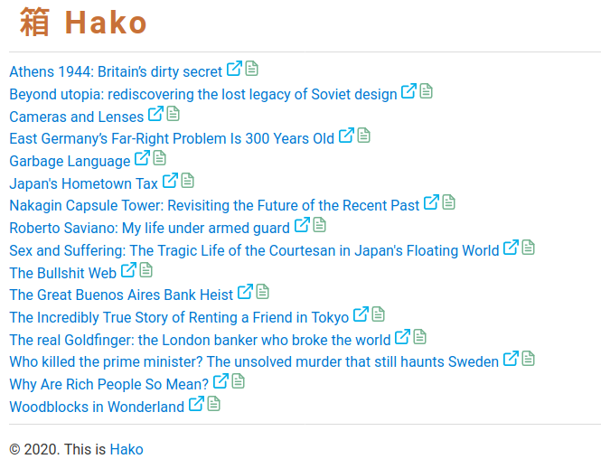

# Hako

Stupidly simple self-hosted web page archiving tool written in PHP.

## Features

- Archive web pages instantly using a bookmarklet
- Readability functionality
- Basic protection via a secret key

## Dependencies

- [Monolith](https://github.com/Y2Z/monolith)
- PHP
- PHP-XML
- Git (optional)

Hako is designed to work out of the box on Linux. With a bit of tweaking, it's possible to make it run on Windows and macOS.

## Installation and usage

Read the [Hako: Stupidly simple DIY web archiving tool](https://tokyoma.de/articles/hako.html) article.

## Problems?

Please report bugs and issues in the [Issues](https://github.com/dmpop/hako/issues) section.

## Contribute

If you've found a bug or have a suggestion for improvement, open an issue in the [Issues](https://github.com/dmpop/hako/issues) section.

To add a new feature or fix issues yourself, follow the following steps.

1. Fork the project's repository.
2. Create a feature branch using the `git checkout -b new-feature` command.
3. Add your new feature or fix bugs and run the `git commit -am 'Add a new feature'` command to commit changes.
4. Push changes using the `git push origin new-feature` command.
5. Submit a merge request.

## Author

[Dmitri Popov](https://www.tokyoma.de/)

# License

The [GNU General Public License version 3](http://www.gnu.org/licenses/gpl-3.0.en.html)
